# StringArtMaker
Make Stringart designs by modifying this code

not exactly user-friendly but gives nice basis of ideas to start with

Just mess around with what to plot, along with the sizes, nailcount, colors and the Nshift values to get differ different shapes.

### Make GIFs
Turn string of pictures into gif from command line:

```sh
convert -delay 20 -loop 0 `ls -v|grep png` gifName.gif
```

Remove pngs afterwards:

```sh
rm `ls -v|grep png` 
```

## Some examples
### Crosses

```python
# Cross1
c1 = Curve(500,13,38,-4,4,0) # plot in red
c2 = Curve(500,13,38,-4,0,5) # plot in blue
c3 = Curve(500,13,38,5,0,0) # plot in yellow
```
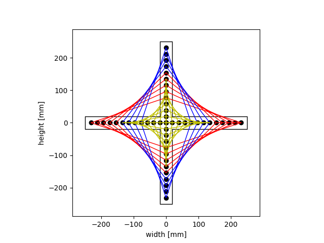
```python
#Cross2
s1 = Straight(500,13,38,0,12,0)
s2 = Straight(500,13,38,0,5,4)
c1 = Curve(500,13,38,-8,0,0) 		
c2 = Curve(500,13,38,5,0,0) 
```
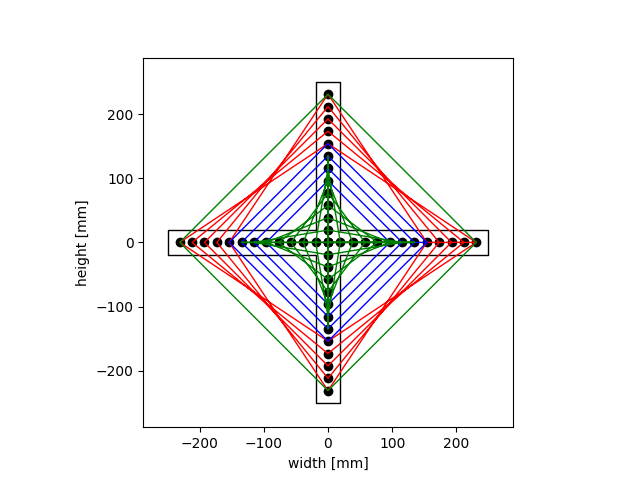
```python
#Cross3
s1 = Straight(500,13,38,0,8,0)
s2 = Straight(500,13,38,0,0,7)
c1 = Curve(500,13,38,0,3,3) 
```
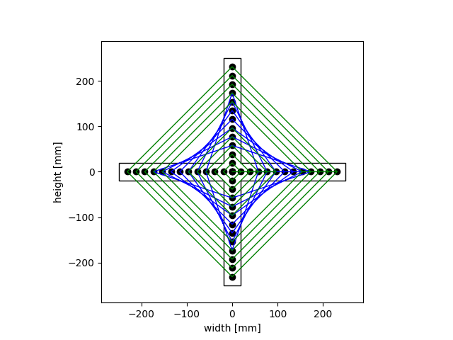

### Triangles
```python
#Triangle1
c1 = Curve(445,22,30,0,0,0,[1,0,0])
c2 = Curve(445,22,30,0,0,0,[0,1,0])
c3 = Curve(445,22,30,0,0,0,[0,0,1])
```
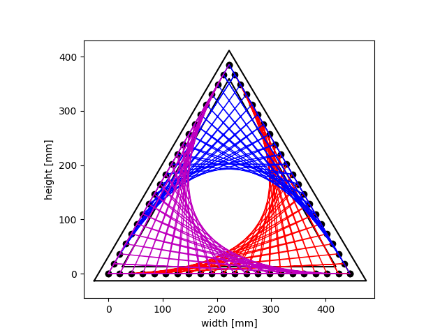

```python
#Triangle1
c1 = Curve(445,22,30,5,0,0)
c2 = Curve(445,22,30,3,0,0)
```
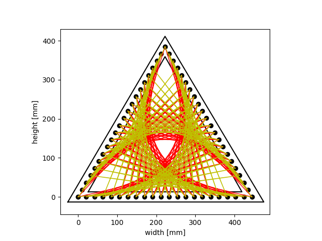

```python
#Triangle1
s1 = Straight(445,22,30,0,0)
c1 = Curve(445,22,30,6,0,0)
```
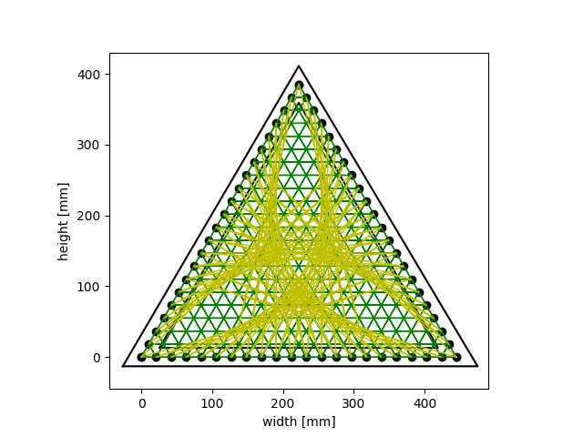

```python
#Triangle4
c1 = Curve(445,22,30,-6,0,0)
c2 = Curve(445,22,30,11,0,0)
```
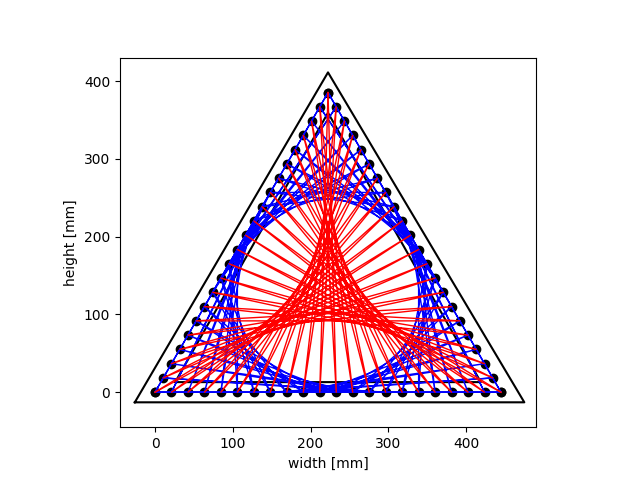

```python
#Triangle5
s1 = Straight(445,22,30,0,0,11)
c1 = Curve(445,22,30,0,17,0)
c2 = Curve(445,22,30,0,0,17)
```
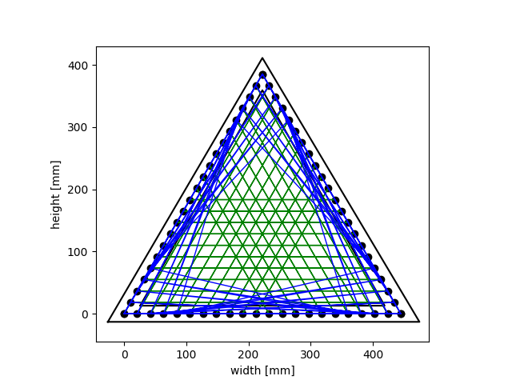


```python
#Triangle6
s1 = Straight(445,22,30,0,0,18)
c1 = Curve(445,22,30,11,0,0)
```
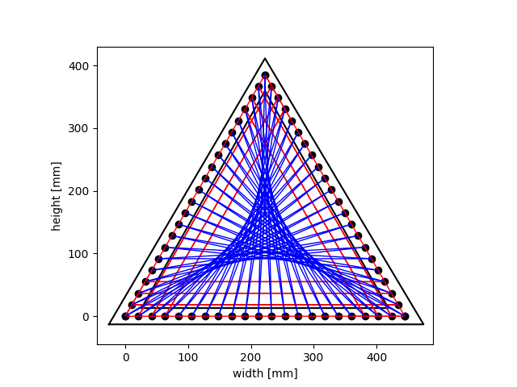

```python
#Triangle7
c1 = Curve(445,22,30,11,0,0)
c2 = Curve(445,22,30,0,0,0)
```
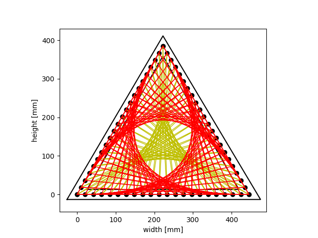

```python
#Triangle8
c1 = Curve(445,22,30,16,0,0)
c2 = Curve(445,22,30,6,0,0)
```


### Squares

```python
#Square3
Xp1 = Xpattern(500,23,30,0,0,0,[1,1])
c1 = Curve(500,23,30,0,0,0)
c2 = Curve(500,23,30,0,0,0)
```
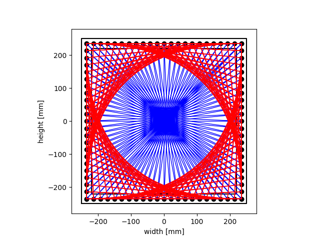

```python
#Square2
z1 = Zigzag(500,23,30,0,0,0)
c1 = Curve(500,23,30,0,0,0,[1,0,1,0])
c2 = Curve(500,23,30,0,0,0,[0,1,0,1])
```
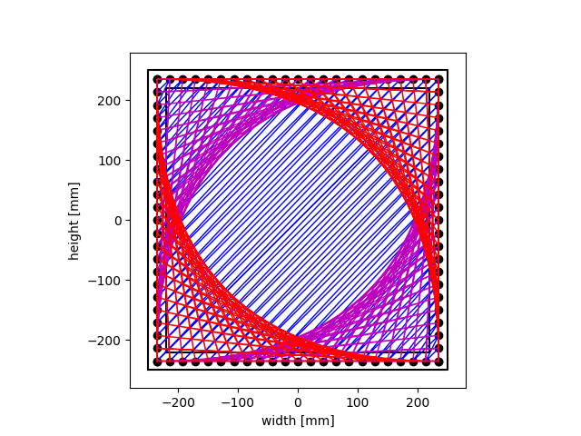

```python
#Square3
c1 = Curve(500,22,30,0,17,0)
c2 = Curve(500,22,30,0,12,5)
c3 = Curve(500,22,30,0,7,10)
c4 = Curve(500,22,30,0,0,15)
```
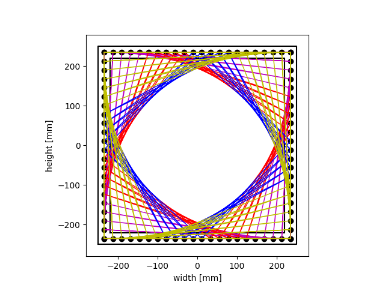

```python
#Square4
Xp1 = Xpattern(500,23,30,13,0,0,[1,0])
Xp2 = Xpattern(500,23,30,-13,0,0,[0,1])
Xp3 = Xpattern(500,23,30,0,0,13,[1,0])
Xp4 = Xpattern(500,23,30,0,13,0,[0,1])
c1 = Curve(500,23,30,0,0,0)

```
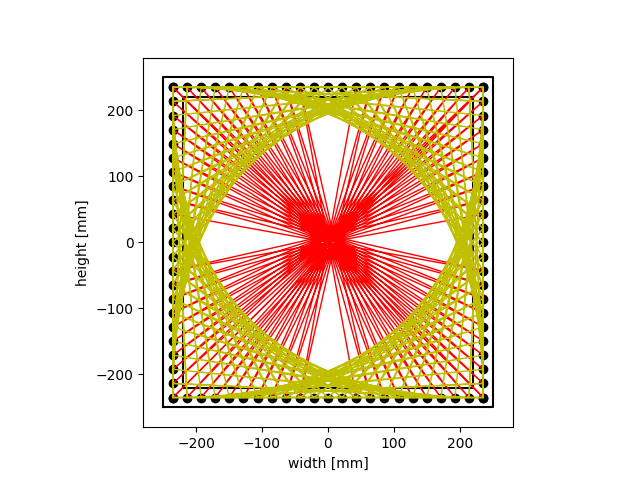


```python
#Square5
z1 = Zigzag(500,23,30,0,0,0,[1,0])
z2 = Zigzag(500,23,30,0,0,0,[0,1])
c1 = Curve(500,23,30,0,0,0,[0,1,0,1])
```
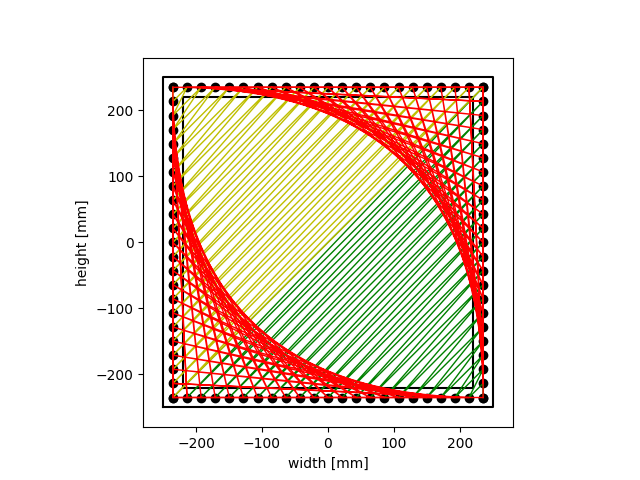

```python
#Square6
Xp1 = Xpattern(500,23,30,0,0,0,[1,0])
c1 = Curve(500,23,30,0,0,0)
c2 = Curve(500,23,30,0,10,10)
```
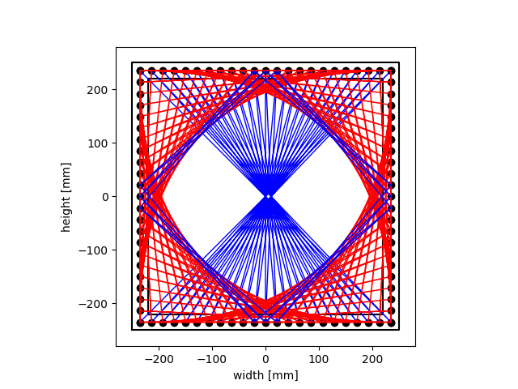

```python
#Square7
c1 = Curve(500,23,30,0,0,0)
c2 = Curve(500,23,30,-5,0,0)
c3 = Curve(500,23,30,-13,0,0)
c4 = Curve(500,23,30,13,0,0)
```
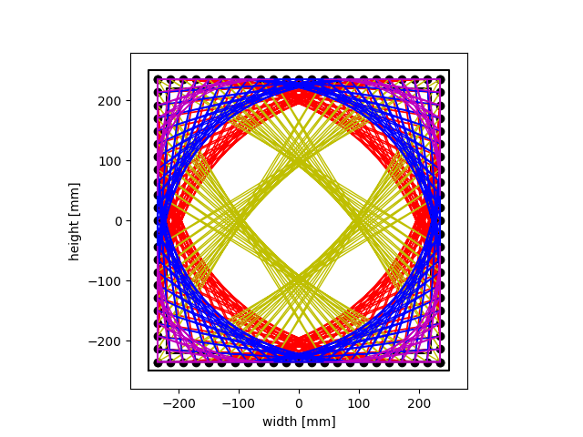

