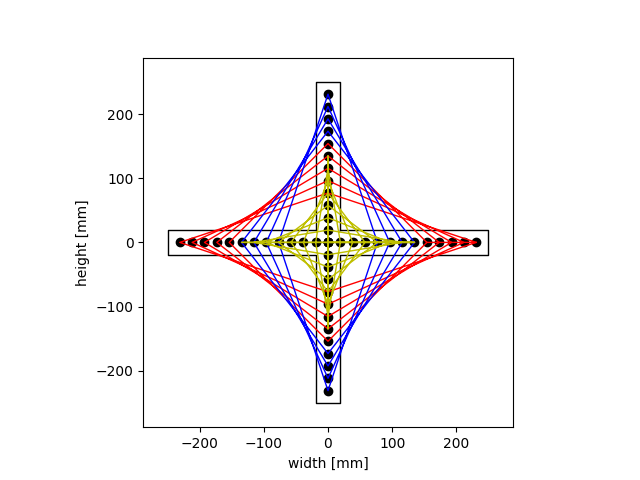
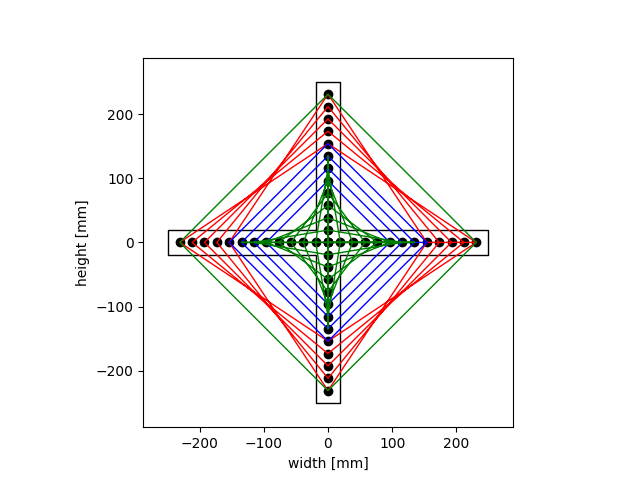

# StringArtMaker
Make Stringart designs by modifying this code

not exactly user-friendly but gives nice basis of ideas to start with

Just mess around with what to plot, along with the sizes, nailcount, colors and the Nshift values to get differ different shapes.

### Make GIFs
Turn string of pictures into gif from command line:

```convert -delay 20 -loop 0 `ls -v|grep png` gifName.gif```

Remove pngs afterwards:

```
rm `ls -v|grep png` 
```

## Some examples
### Crosses

```python
# CrossA
c1 = Curve(500,13,38,-4,4,0) # plot in red
c2 = Curve(500,13,38,-4,0,5) # plot in blue
c3 = Curve(500,13,38,5,0,0) # plot in yellow
```

```python
#CrossB
s1 = Straight(500,13,38,0,12,0)
s2 = Straight(500,13,38,0,5,4)
c1 = Curve(500,13,38,-8,0,0) 		
c2 = Curve(500,13,38,5,0,0) 
```



# SquareA
```python
#SquareA
c1 = Curve(500,22,30,17,0,0)
c2 = Curve(500,22,30,12,0,5)
c3 = Curve(500,22,30,7,0,10)
c4 = Curve(500,22,30,0,0,15)
```

